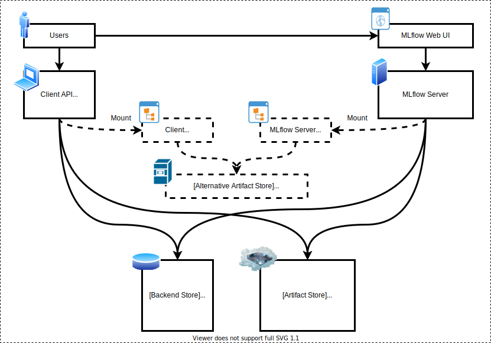
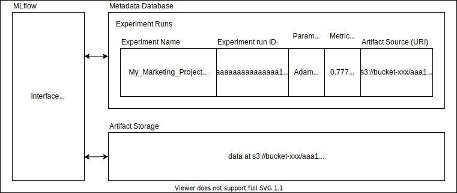
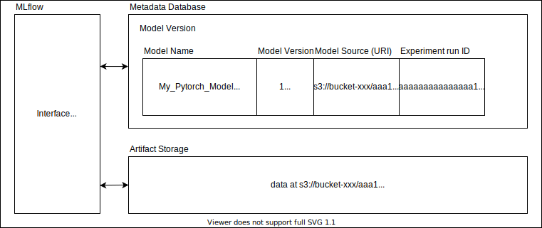

# Tools_for_ML_Lifecycle_Management

Comparison of tools for ML experiment tracking & model management for companies 

Notes:
- Editions limited to a single user, which might be useful for Kaggle competitions and academic research, are excluded.
- `?` means unclear/uncertain.
- Tools are ordered by the number of stars in the GitHub repository.
- Updated on 2020/12/13

&nbsp;
## Free tools

| Tool                               | Monthly Fee | On-prem supported | # Stars on GitHub repository (100s) | URL                                    |
|------------------------------------|-------------|-------------------|-------------------------------------|----------------------------------------|
| MLflow                             | Free        | Yes               | 8000                                | https://github.com/mlflow/mlflow       |
| DVC                                | Free        | Yes               | 6900                                | https://github.com/iterative/dvc       |
| Pachyderm (Community)              | Free        | Yes               | 4800                                | https://github.com/pachyderm/pachyderm |
| Sacred                             | Free        | Yes               | 3200                                | https://github.com/IDSIA/sacred        |
| Polyaxon (Community)               | Free        | Yes               | 2600                                | https://github.com/polyaxon/polyaxon   |
| Allegro Trains                     | Free        | Yes               | 2000                                | https://github.com/allegroai/trains    |
| VertaAI ModelDB                    | Free        | Yes               | 1100                                | https://github.com/VertaAI/modeldb     |
| Kubeflow Katib                     | Free        | Yes               | 900                                 | https://github.com/kubeflow/katib      |
| Guild AI                           | Free        | Yes               | 500                                 | https://github.com/guildai/guildai     |
| Google ML Metadata (+ Kubeflow UI) | Free        | Yes               | 200                                 | https://github.com/google/ml-metadata  |

| Tool                               | Backend Metadata Database                     | Backend Artifact Storage                       | K8s      | Server Source Code      | Client Source Code |
|------------------------------------|-----------------------------------------------|------------------------------------------------|----------|-------------------------|--------------------|
| MLflow                             | SQL DB (PostgreSQL / MySQL / MS SQL / SQLite) | Object (S3, etc), File System, HDFS, FTP, SFTP | Optional | Open (JavaScript)       | Open (Python)      |
| DVC                                | Git Repository                                | Object (S3, etc), File System                  | Optional | No server               | Open (Python)      |
| Pachyderm (Community)              | etcd                                          | Object (S3)                                    | Required | Open (Go)               | Open (Python)      |
| Sacred                             | MongoDB                                       | MongoDB                                        | Optional | Open (JavaScript)       | Open (Python)      |
| Polyaxon (Community)               | PostgreSQL                                    | Object (S3, etc), File System                  | Required | Open (Python, Java, Go) | Open (Python)      |
| Allegro Trains                     | Elasticsearch & MongoDB                       | Object (S3, etc), File System                  | Optional | Open (Python)           | Open (Python)      |
| VertaAI ModelDB                    | PostgreSQL                                    | Object (S3, etc), File System                  | Optional | Open (Java)             | Open (Python)      |
| Kubeflow Katib                     | Google ML Metadata?                           | Google ML Metadata?                            | Required | Open (Go, JavaScript)   | Open (Python)      |
| Guild AI                           | File System                                   | File System                                    | Optional | No server               | Open (Python)      |
| Google ML Metadata (+ Kubeflow UI) | MySQL / SQLite                                | Object (GCS), File System                      | Optional | Open (C++)              | Open (Python)      |

| Tool                               | Experiment Tracking | Artifact Repository | Model Registry | Hyper-parameter Tuning | Distributed Hyper-parameter Tuning |
|------------------------------------|---------------------|---------------------|----------------|------------------------|------------------------------------|
| MLflow                             | Yes                 | Yes                 | Yes            | No                     | No                                 |
| DVC                                | No                  | Yes                 | No             | No                     | No                                 |
| Pachyderm (Community)              | No                  | Yes                 | No             | No                     | No                                 |
| Sacred                             | Yes                 | Yes                 | No             | No                     | No                                 |
| Polyaxon (Community)               | Yes                 | Yes                 | No             | Yes                    | No                                 |
| Allegro Trains                     | Yes                 | Yes                 | No             | Yes                    | No                                 |
| VertaAI ModelDB                    | Yes                 | Yes                 | Yes            | No                     | No                                 |
| Kubeflow Katib                     | No                  | No                  | No             | Yes                    | Yes                                |
| Guild AI                           | Yes                 | No                  | No             | Yes                    | No                                 |
| Google ML Metadata (+ Kubeflow UI) | Yes                 | Yes                 | No             | No                     | No                                 |

| Tool                               | Web UI                    | REST API  | CLI  | Python API | Bypass server by CLI / Python API | Native Access Control |
|------------------------------------|---------------------------|-----------|------|------------|-----------------------------------|-----------------------|
| MLflow                             | Yes                       | HTTP      | Yes  | Yes        | Yes                               | No                    |
| DVC                                | No (GitLab / GitHub only) | No server | Yes  | Yes        | Yes                               | No                    |
| Pachyderm (Community)              | No                        | ProtoBuf  | Yes  | Yes        | No?                               | No                    |
| Sacred                             | Yes (Omniboard)           | No        | Yes  | Yes        | No?                               | No                    |
| Polyaxon (Community)               | Yes                       | HTTP      | Yes  | Yes        | No?                               | No                    |
| Allegro Trains                     | Yes                       | No?       | No?  | Yes        | No?                               | No                    |
| VertaAI ModelDB                    | Yes                       | No        | No?  | Yes        | No                                | No                    |
| Kubeflow Katib                     | Yes (Kubeflow UI)         | gRPC      | Yes  | Yes        | No                                | No                    |
| Guild AI                           | No (TensorBoard only)     | No server | Yes  | ?          | Yes                               | No                    |
| Google ML Metadata (+ Kubeflow UI) | Yes (Kubeflow UI)         | gRPC      | Yes  | Yes        | No                                | No                    |

&nbsp;
## Paid tools

| Tool                          | Monthly Fee | On-prem supported | # Stars on GitHub repository (100s) | URL                                            |
|-------------------------------|-------------|-------------------|-------------------------------------|------------------------------------------------|
| MLflow (Managed)              | Paid        | No                | 8000                                | https://databricks.com/product/managed-mlflow  |
| Pachyderm (Enterprise / Hub)  | Paid        | Yes (Enterprise)  | 4800                                | https://www.pachyderm.com/platform/#enterprise |
| Polyaxon (Enterprise / Cloud) | Paid        | Yes (Enterprise)  | 2600                                | https://polyaxon.com/polyaxon-ee/              |
| Weights & Biases (Enterprise) | Paid        | Yes               | 2500                                | https://docs.wandb.com/self-hosted             |
| Verta (Enterprise, SaaS)      | Paid        | Yes (Enterprise)  | 1100                                | https://www.verta.ai/pricing                   |
| Neptune.ai (Enterprise)       | Paid        | Yes               | 100                                 | https://github.com/neptune-ai/neptune-client   |
| Valohai (Enterprise, Pro)     | Paid        | Yes (Enterprise)  | 0                                   | https://github.com/valohai/valohai-cli         |
| Comet (Enterprise)            | Paid        |                   | -                                   | https://www.comet.ml/site/pricing/             |

| Tool                          | Backend Metadata Database                     | Backend Artifact Storage                       | K8s      | Server Source Code | Client Source Code |
|-------------------------------|-----------------------------------------------|------------------------------------------------|----------|--------------------|--------------------|
| MLflow (Managed)              | SQL DB (PostgreSQL / MySQL / MS SQL / SQLite) | Object (S3, etc), File System, HDFS, FTP, SFTP | Optional | Not Open           | Open (Python)      |
| Pachyderm (Enterprise / Hub)  | etcd                                          | Object (S3)                                    | Required | Not Open           | Not Open           |
| Polyaxon (Enterprise / Cloud) | PostgreSQL                                    | Object (S3, etc), File System                  | Required | Not Open           | No                 |
| Weights & Biases (Enterprise) | MySQL                                         | Object (S3, etc.)                              | ?        | Not Open           | Open (Python)      |
| Verta (Enterprise, SaaS)      | PostgreSQL                                    | Object (S3, etc), File System                  | Optional | Not Open           | Open               |
| Neptune.ai (Enterprise)       | ?                                             | ?                                              | ?        | Not Open           | Open (Python)      |
| Valohai (Enterprise, Pro)     | ?                                             | ?                                              | ?        | Not Open           | Open (Python)      |
| Comet (Enterprise)            | ?                                             | ?                                              | Optional | Not Open           | No                 |

| Tool                          | Experiment Tracking | Artifact Repository | Model Registry | Hyper-parameter Tuning | Distributed Hyper-parameter Tuning |
|-------------------------------|---------------------|---------------------|----------------|------------------------|------------------------------------|
| MLflow (Managed)              | Yes                 | Yes                 | Yes            | No                     | No                                 |
| Pachyderm (Enterprise / Hub)  | No                  | Yes                 | No             | No                     | No                                 |
| Polyaxon (Enterprise / Cloud) | Yes                 | Yes                 | Yes?           | Yes                    | Yes                                |
| Weights & Biases (Enterprise) | Yes                 | Yes                 | No             | Yes                    | Yes                                |
| Verta (Enterprise, SaaS)      | Yes                 | Yes                 | Yes            | No                     | No                                 |
| Neptune.ai (Enterprise)       | Yes                 | Yes                 | No?            | No                     | No                                 |
| Valohai (Enterprise, Pro)     | Yes                 | Yes                 | Yes?           | No?                    | No?                                |
| Comet (Enterprise)            | Yes                 | Yes                 | Yes            | Yes                    | No?                                |

| Tool                          | Web UI | REST API | CLI  | Python API | Bypass server by CLI / Python API | Native Access Control |
|-------------------------------|--------|----------|------|------------|-----------------------------------|-----------------------|
| MLflow (Managed)              | Yes    | HTTP     | Yes  | Yes        | No?                               | Yes                   |
| Pachyderm (Enterprise / Hub)  | Yes    | ProtoBuf | Yes  | Yes        | No?                               | Yes                   |
| Polyaxon (Enterprise / Cloud) | Yes    | HTTP     | Yes  | Yes        | No                                | Yes                   |
| Weights & Biases (Enterprise) | Yes    | No?      | Yes  | Yes        | No?                               | ?                     |
| Verta (Enterprise, SaaS)      | Yes    | No       | No?  | Yes        | No                                | No                    |
| Neptune.ai (Enterprise)       | Yes    | No?      | ?    | Yes        | No?                               | ?                     |
| Valohai (Enterprise, Pro)     | Yes    | No?      | No?  | Yes        | No?                               | ?                     |
| Comet (Enterprise)            | Yes    | HTTP     | Yes  | Yes        | No?                               | Yes                   |

&nbsp;
## MLflow

### MLflow Architecture

### MLflow Experiment Tracking

### MLflow Model Registry

## Polyaxon Architecture

## Allegro Trains Architecture

## VertaAI ModelDB Architecture

## Google ML Metadata Architecture

